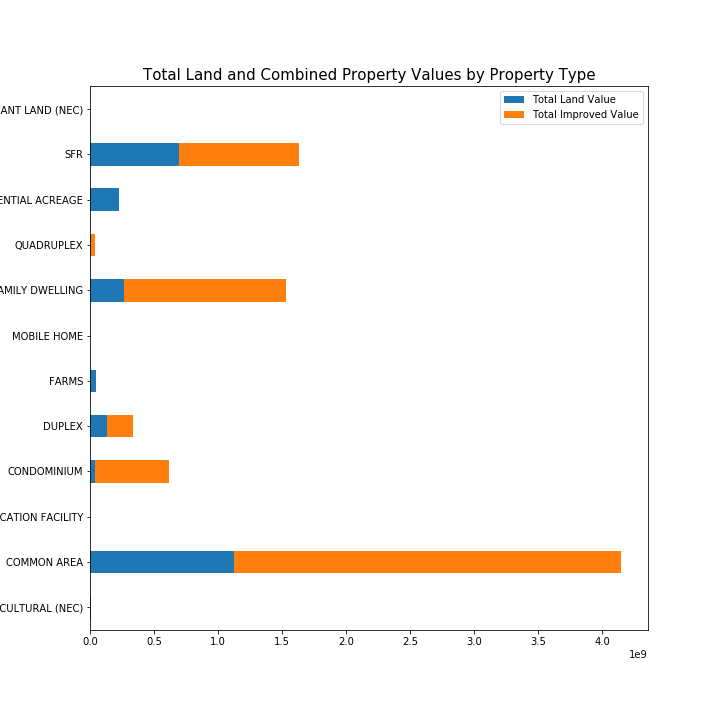
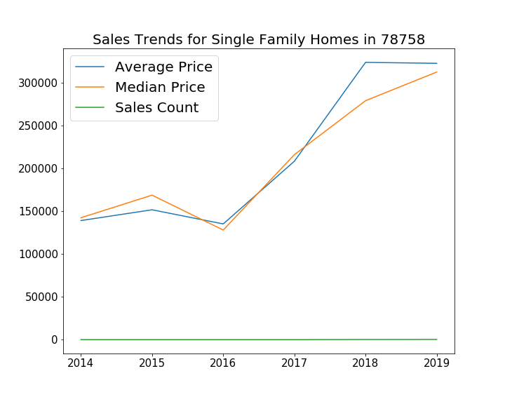
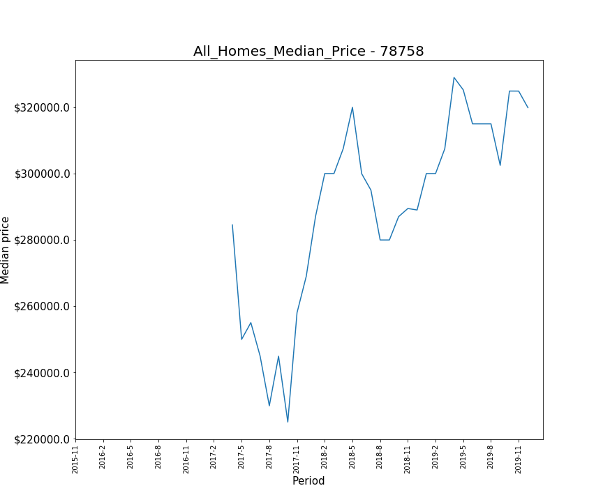

# Extracting Building Values by Zip Code
---

Created by Amit Marwaha, Colton Dowling, and Meggan Lanpher

---

## Problem Statement

During a disaster, it is important to model and estimate the potential or forecasted effect of the event, including the projected/forecasted damage.

Existing indicators of forecasted damage include number of structures within the affected area, number of people in the area, number of households, demographics of the impacted population, etc. This project will add an additional indicator: the value of the properties in the affected area.

## Building a Simple API

### Data Collection

Data Sources:
- [ATTOM Property Data API](https://www.attomdata.com)
  ---> API key needed
- [Zillow](https://www.zillow.com)
== [Quandl](https://www.quandl.com)
  ---> API key needed
- [Realtor.com](https://www.realtor.com)
- [Zipcodes](https://pypi.org/project/zipcodes/)

#### Data Dictionary

[(ATTOM API Docs)](https://api.developer.attomdata.com/docs)

| Feature | ATTOM Field Name| Description |
| --- | --- | --- |
| Zip Code | postal1 | For the U.S. this is the 5-digit ZIP Code |
| Property type - indicator | proptype | A specific property classification such as "Detached Single Family" |
| Calculated Improved Value | calcimprvalue | Derived Assessed Value of the improvement(s) used to calculate property tax |
| Calculated Land Value | calclandvalue | Derived Assessed Value of the land used to calculate property tax |
| Calculated Total Value | calcttlvalue | Derived Total Value used to calculate property tax |

### API Deliverable
We created a Simple API that can be utilized in a Python IDE.

First, the user will input the desired zip code and date of which they are interested in seeing property value data. The Simple API will return the Mean, Median, Minimum, Maximum, and Total Values of the Land, Improved, and Calculated Total Property Values.

-- "There are 9264 properties found in the 78758 zipcode for the year preceding 2/21/2020."

Then, the user may opt to receive this information broken down by property type.

Lastly, the user may opt to see the historical sales trends of the given zip code.

-- "This dataset includes 50 months of Zillow sales data."

## Conclusions

Our simple API may be utilized by a government agency, such as FEMA, to determine the range of property values within a given zip code and therefore how much aid may be required to repair damages to properties in the area. This property value data may be combined with many other factors in order to build a prediction model for the direct damages of a natural disaster in a given area. Other factors include but are not limited to the type and severity of the storm, types of industries in the area, and dynamics of the population demographics. Calculating the economic impact of a disaster would include many indirect costs, such as wage loss and decreased market supply. So the total economic loss may not be directly determined, but there is some macroeconomic research that can help explain further damage costs.

### Resources

- ["How a Disaster’s Economic Impacts Are Calculated"](https://www.theatlantic.com/business/archive/2017/08/harvey-economic-impacts/538353/)
- ["A Multiregional Impact Assessment Model for disaster analysis"](https://www.tandfonline.com/doi/full/10.1080/09535314.2016.1232701)
- ["Predicting Postdisaster Residential Housing Reconstruction Based on Market Resources"](https://ascelibrary.org/doi/pdf/10.1061/%28ASCE%29NH.1527-6996.0000339)
- ["The Economic Impacts of Natural Disasters: A Review of Models and Empirical Studies"](https://academic.oup.com/reep/article/13/2/167/5522921#139660432)
